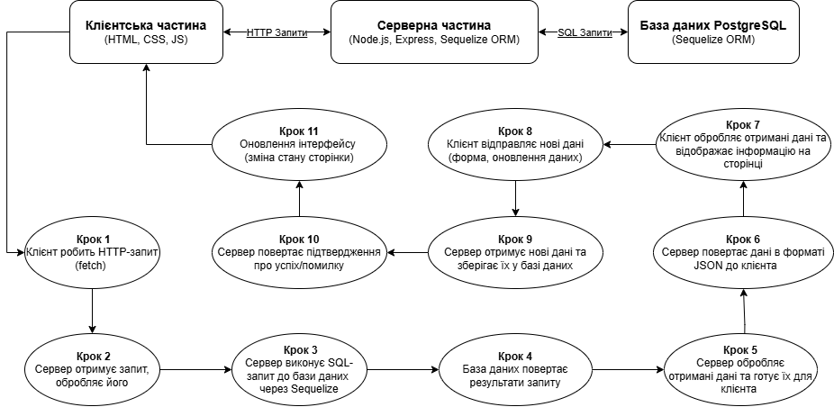

## Основні Файли та Папки

### `form_application.js`
Цей файл містить основну серверну логіку. Він налаштовує Express для обробки запитів та використовує Sequelize для взаємодії з базою даних PostgreSQL. Тут також реалізовані маршрути для отримання даних про факультети, спеціальності, пільги та гуртожитки.

### `package.json` / `package-lock.json`
Ці файли містять всі залежності для проєкту. Вони визначають пакети, необхідні для роботи сервера та фронтенду, такі як Express, Sequelize, EJS тощо.

### `prepros.config`
Конфігурація для Prepros, інструменту для компіляції SCSS в CSS, мініфікації файлів та автоматичного оновлення браузера.

### `README.md`
Документація для розробників, що містить опис проєкту, налаштування та інструкції щодо запуску.

### `.vscode`
Налаштування для редактора коду Visual Studio Code.

### `node_modules`
Папка для залежностей Node.js, що інсталюються через команду `npm install`.

### `public`
Папка для файлів, таких як HTML, доступних на стороні клієнта.
- **`index.html`** — основний HTML файл для фронтенду.

### `src`
Папка для SCSS стилів:
- **`style.scss`** — головний файл SCSS для стилізації сайту.
- Інші файли SCSS для специфічних компонентів інтерфейсу (наприклад, **`_accommodation.scss`**, **`_dormitories.scss`**).

### `static`
Папка для статичних файлів, таких як скомпільовані CSS та JavaScript файли:
- **`style.css`** — зкомпільований CSS.
- **`script`** — JavaScript файли для взаємодії з клієнтським інтерфейсом:
  - **`dormitories.js`** — скрипт для роботи з даними гуртожитків.
  - **`navigation.js`** — скрипт для навігації та прокручування сторінки.
  - **`select.js`** — скрипт для заповнення селектів на основі даних.

## Ключові Компоненти

### Серверна частина (`form_application.js`)
- Використовує **Express** для маршрутизації та обробки запитів.
- Використовує **Sequelize ORM** для взаємодії з базою даних PostgreSQL.
- **Моделі Sequelize**:
  - `Faculty`, `Specialty`, `Benefit`, `Application`, `Dormitories`, `Price` — моделі для таблиць в базі даних.
  - Визначені зв'язки між моделями через методи `hasMany`, `belongsTo`.

### Клієнтська частина
- **HTML** для структури сторінки.
- **SCSS/CSS** для стилізації сторінки.
- **JavaScript** для динамічної взаємодії з користувачем:
  - Взаємодія з сервером через `fetch` для отримання даних.
  - Обробка кліків по елементах для оновлення контенту сторінки.

## Взаємодія Клієнт-Сервер

1. **Клієнтська частина** робить запити до серверу для отримання даних:
   - Використовує метод `fetch` для отримання даних про факультети, спеціальності, пільги та гуртожитки.

2. **Серверна частина** відповідає на запити JSON даними, отриманими через Sequelize ORM:
   - Дані зберігаються у базі даних PostgreSQL та доступні через відповідні моделі.





## Виявлені проблеми та пропозиції з покращення

### 1. **Не визначені змінні** (Issue Type: Undefined Variables)

#### Проблеми:
- `'require' is not defined` на рядках 1, 2, 3.
- `'__dirname' is not defined` на рядку 9.

#### Рядки коду:
```js
const express = require('express');
const { Sequelize, DataTypes } = require('sequelize');
const path = require('path');
app.use('/static', express.static(path.join(__dirname, 'static')));
```

#### Опис:
Змінні `require` і `__dirname` не визначені в середовищі браузера, яке, ймовірно, використовується для цього коду. Це може бути помилка налаштувань середовища або неправильне використання цих змінних у клієнтському JavaScript.

#### Рішення:
Перевірити, чи виконується цей код на сервері Node.js, оскільки `require` і `__dirname` доступні лише в Node.js.

#### Шкідливий вплив:
Ці змінні працюють тільки на сервері, а в браузері — ні. Якщо їх використовувати на стороні клієнта, програма не запуститься.
  - **Читабельність:** Це створює плутанину для інших розробників, бо вони не зрозуміють, чому код не працює.
  - **Продуктивність:** На продуктивність не впливає безпосередньо, але можуть бути затримки в процесі тестування і виправлення помилок, якщо це не помітити.

### 2. **Не використовувана змінна** (Issue Type: Unused Variables)

#### Проблема:
- `'newApplication' is assigned a value but never used` на рядку 257.

#### Рядки коду:
```js
const newApplication = await Application.create(...);
```

#### Опис:
Змінна `newApplication` присвоєна, але не використовується в подальшому коді. Це створює зайве зберігання даних, що не має впливу на програму.

#### Рішення:
Якщо змінна не потрібна, її слід видалити. Якщо вона потрібна для подальших операцій, додати код для її використання.

#### Шкідливий вплив:
Якщо змінна створена, але не використовується, це зайва операція. Розробникам може бути не зрозуміло, навіщо вона потрібна, і це ускладнює розуміння коду.
  - **Читабельність:** Інші розробники можуть витратити час, щоб зрозуміти чому вона була створена.
  - **Продуктивність:** Це не впливає прямо на швидкість, але додає зайвий код, що ускладнює роботу.

### 3. **Примітивне дублювання коду** (Issue Type: Code Duplication)

#### Проблема:
Дублювання коду в обробниках запитів для отримання даних з бази (наприклад, `/fetch-select-data/faculties`, `/fetch-select-data/specialties`, `/fetch-select-data/benefits`, `/fetch-select-data/dormitories/:dormitoryId`).

#### Рішення:
Створення загального методу для обробки запитів на отримання списків даних, щоб уникнути дублювання логіки

#### Шкідливий вплив:
Якщо одна і та сама логіка повторюється в кількох місцях, це може привести до помилок при змінах. Якщо змінюєш щось в одному місці, треба змінювати це і в іншому.
 - **Читабельність:** Це збільшує обсяг коду, він стає важчим для розуміння, і знайти помилки стає складніше.
  - **Продуктивність:** Дублювання коду може зробити програму менш ефективною, особливо в великих проєктах.

### 4. **Складність і зрозумілість коду** (Issue Type: Code Complexity)

#### Проблема:
Обробник POST-запиту для подачі заявки має великий обсяг коду з перевірками та створенням записів у базі даних. Це може ускладнити підтримку коду при необхідності змін.

#### Рішення:
Рефакторинг цієї частини коду в окрему функцію для обробки введених даних

#### Шкідливий вплив:
Якщо вся логіка вміщена в одному місці, її важко зрозуміти і змінювати. Внесення змін може зайняти багато часу, і це створює великі труднощі для тестування.
  - **Читабельність:** Це робить код громіздким і важким для розуміння. 
  - **Продуктивність:** Погіршення зрозумілості коду може вплинути на швидкість розробки і виправлення помилок, а також на час, який витрачається на тестування.

### 5. **Відсутність обробки помилок для асинхронних функцій** (Issue Type: Error Handling)

#### Проблема:
Не всі асинхронні функції мають належну обробку помилок.

#### Рішення:
Переконатись, що для всіх асинхронних операцій додано обробку помилок, особливо в обробниках маршрутів.


#### Шкідливий вплив:
Якщо не обробляти помилки асинхронних функцій, програма може просто зупинитися, і в результаті не буде отримано корисної інформації про те, чому це сталося.
  - **Читабельність:** Це робить код менш зрозумілим, бо важко зрозуміти, як реагувати на помилки.
  - **Продуктивність:** Через відсутність обробки помилок, виправлення проблем займе більше часу.


### 6. Використання `expect` всередині умовного блоку (Issue Type: Jest Testing Rule Violation)  
#### Проблема:
Функція `expect` викликається умовно (наприклад, всередині `if`, `for`, `while`, `try/catch`), що може призвести до того, що деякі перевірки не будуть виконані.  

#### Рішення:
Переписати код так, щоб `expect` виконувався завжди.

#### Шкідливий вплив:  
- **Надійність тестів:** Умовні `expect` можуть пропускати перевірки, що може призвести до помилково успішних тестів.  
- **Читабельність:** Такий код важче аналізувати, оскільки не всі перевірки є очевидними.  


### 7. Використання `module` в середовищі без його визначення (Issue Type: Undefined Variable)  
#### Проблема:
Змінна `module` не визначена у файлі, що може бути спричинене використанням `module.exports` у середовищі ES-модулів (ESM).  

#### Рішення:
Переконатися, що використовується правильний підхід для експорту залежно від середовища

#### Шкідливий вплив:
- **Сумісність:** Неправильний підхід до експорту може призвести до помилок під час імпорту в інших частинах програми.  
- **Продуктивність:** Неправильне визначення типу модуля може змусити розробників витрачати більше часу на усунення несумісностей.  